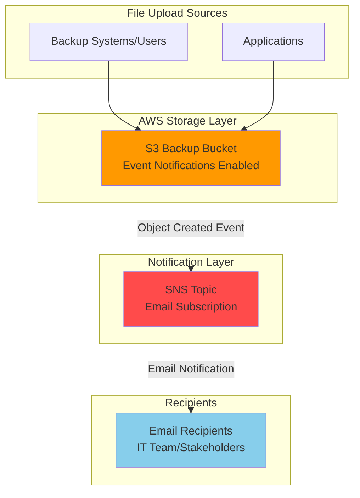

# Simple File Backup Notifications with S3 and SNS

## Problem 
Organizations need real-time visibility into their backup operations and
file transfers to ensure data protection compliance and operational realiability.
Wihtout automated notifcations, IT teams often discover failed backups or missing
files hours or days later, creating potential data loss risks and compliance violations. 
Manual monitoring of S3 bucket is time-consuming and pronte to human erro, making
it difficult to maintain consistent backup verficitaion processes.

## Solution
Create an automated notification system using Amazon S4 event notifications 
integrated with Amazon SNS (Simple Notification Service) to send instant email
alerts whenever files are uploaded to your backup bucket. This serverless 
solution provides real-time monitoring of backup operations while elimninating
the need for manual checking or custom monitoring scripts, ensuring immediate
awareness of successful file transfers and backup completions.

## Architecture

## Prerequisites

1. AWS account with permissions to create S3 buckets and SNS topics
2. AWS CLI installed and configured (or use CloudShell)
3. Basic understanding of S3 bucket operations and email notifications
4. Valid email address for receiving notifications
5. Estimated cost: $0.01-$0.50 per month for typical backup notification usage

