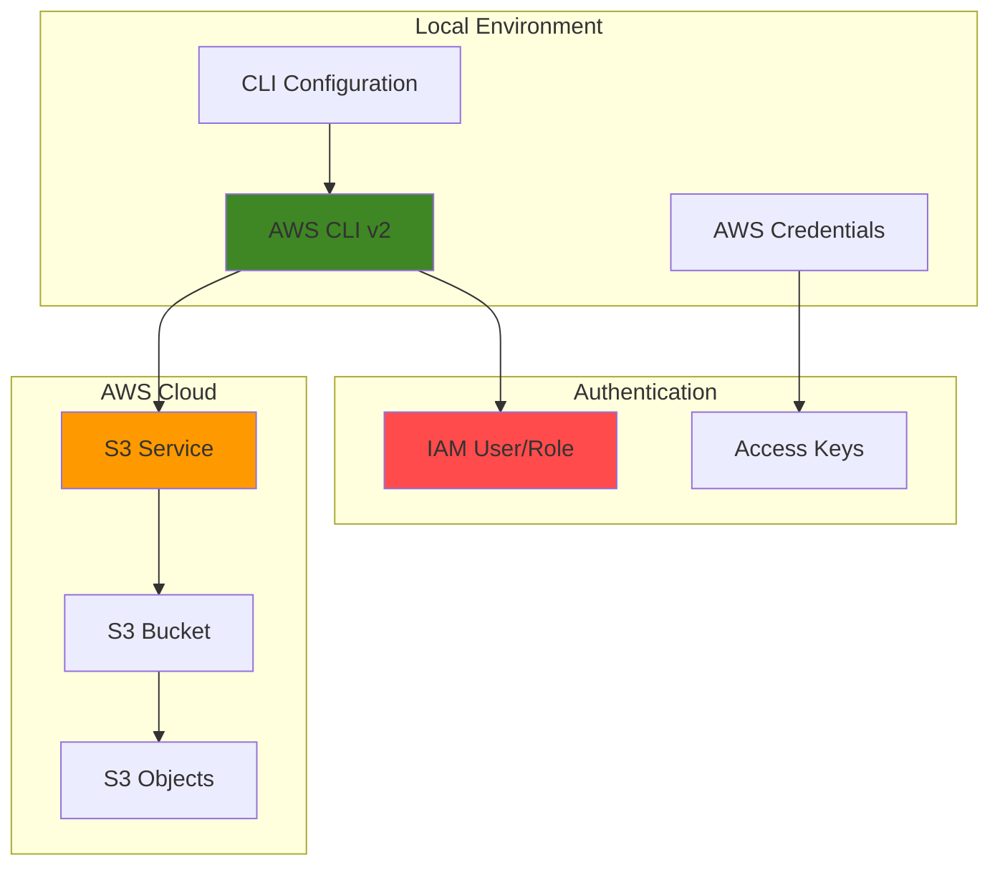

# AWS CLI Setup and First Command with CLI and S3

## Problem

Organizations need efficient command-line access to AWS services for automation,
scripting, and daily operations. Many developers and system administrators 
struggle with initial AWS ClI setup, credentials configuration, and learning 
essential command. Without proper CLI access, teams resort to manual console
operations that are time-consuming, error-prone, and difficult to automate or
integrate into CI/CD pipelines.

## Solution

Install and configute the AWS CLI v2 with proper credentials and security best
practices, then learn fundamental S3 operations through hands-on practice. This
approach establishes a solid foundation for AWS automation by providing secure
programmatic access to AWS services through a standardized command-line 
interface that supports scripting, automation and integration with 
development workflows.

## Architecture Diagram



## Prerequisites

1. AWS account with appropriate permissions for IAM and S3 services
2. Administrative access to install software on your local machine
3. Basic understanding of command-line interfaces and terminal usage
4. Text editor for configuration file management
5. Estimated cost: Free (AWS CLI is free, S3 operations may incur minimal charges for testing)

## Steps

1. **Install AWS CLI v2**
    The AWS CLI v2 provides enhanced features, improved performance, and better
    security compared to v1. It's the recommended version for new installations
    and includes support for features like AWS SSO, enhanced credential 
    management, and improved output formatting that follows AWS securit best
    practices.

    ```bash
    # For Linux x86_64
    curl "https://awscli.amazonaws.com/awscli-exe-linux-x86_64.zip" \
    -o "awscliv2.zip"
    unzip awscliv2.zip
    sudo ./aws/install

    # For macOS (Intel)
    # curl "https://awscli.amazonaws.com/AWSCLIV2.pkg" -o "AWSCLIV2.pkg"
    # sudo installer -pkg AWSCLIV2.pkg -target /

    # For macOS (Apple Silicon)
    # curl "https://awscli.amazonaws.com/AWSCLIV2-arm64.pkg" -o "AWSCLIV2.pkg"
    # sudo installer -pkg AWSCLIV2.pkg -target /

    # For Windows (PowerShell as Administrator)
    # msiexec.exe /i https://awscli.amazonaws.com/AWSCLIV2.msi /quiet

    # Verify installation
    aws --version

    echo "✅ AWS CLI v2 installed successfully"
    ```
2. **Configure AWS CLI Credentials**
    Proper credential management is essential for secure AWS CLI usage. The
    `aws configure` command sets up you access key, default region, and output
    format in a secure credential store that follows AWS security best practices
    and creates encrypted files with approriate file permissions.

    ```bash
    # Configure AWS CLI with your credentials
    # You'll be prompted for:
    # - AWS Access Key ID (from your IAM user)
    # - AWS Secret Access Key (from your IAM user)
    # - Default region name (e.g., us-east-1, us-west-2)
    # - Default output format (json recommended for automation)
    aws configure

    # Verify configuration without exposing credentials
    aws configure list

    # Test authentication with STS service
    aws sts get-caller-identity

    echo "✅ AWS CLI configured and authenticated"
    ```
