# Simple Random Data API with Lambda and API Gateway

## Problem
New Developers learning cloud development need a straightforward way to 
understand serverless APIs without complex infrastructure management. 
Traditional server-based APIs require provisioning, scaling and maintenance,
creating barriers for beginners who want to focus on API functionality 
rather than administration.

## Solution
Create a serverless REST API using AWS Lambda and API Gateway for HTTP routing
that generates random data including quotes, numbers, and colors. This approach
eliminates server management while providing a scalable, cost-effective API
that automatically handles traffic spikes and scalte to zero when not in use.

## Architecture

```mermaid
graph TB
    subgraph "Client Layer"
        CLIENT[API Client / Browser]
    end
    
    subgraph "AWS API Gateway"
        GATEWAY[REST API Gateway]
        RESOURCE[&#47;random Resource]
        METHOD[GET Method]
    end
    
    subgraph "AWS Lambda"
        FUNCTION[Random Data Function<br/>Python 3.12]
        LOGIC[Random Generation Logic]
    end
    
    subgraph "AWS CloudWatch"
        LOGS[Function Logs]
        METRICS[API Metrics]
    end
    
    CLIENT --> GATEWAY
    GATEWAY --> RESOURCE
    RESOURCE --> METHOD
    METHOD --> FUNCTION
    FUNCTION --> LOGIC
    FUNCTION --> LOGS
    GATEWAY --> METRICS
    
    FUNCTION -.-> CLIENT
    
    style FUNCTION fill:#FF9900
    style GATEWAY fill:#FF4B4B
    style CLIENT fill:#4B8BFF
```

## Prerequisites
1. AWS account with Lambda and API Gateway permissions.
2. AWS CLI v2 installed and configured wiht appropriate credentials.
3. Basic understanding of REST APIs and JSON responses
4. Text editor or IDE for writing Python code.
5. Estimated cost: $0.00-$0.20 for testing (within AWS Free Tier limits).

