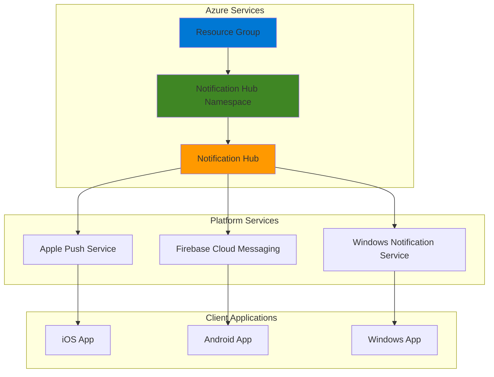

# Basic Push Notifications with Notification Hubs

## Problem
Mobile applications require reliable push notification capabilities to engage
users with timely updated, alerts, and promotional messages. Setting up 
platform-specific notification services across iOS, Android, and Windows can 
be complex and time-consuming, requiring seperate integrations with 
Apple Push Notification Service (APNS), Firebase Cloud Messaging (FCM), and 
Windows Notification Service (WNS). Managing device registrations, handling 
failures, and scaling notification delivery across multiple platforms
creates significant overhead for mobile teams.

## Solution
Azure Notification Hubs provides a unified, serverless push notification engine
that simplifies cross-platform notification delivery. This managed service 
abstracts platform-specific complexities, offering a single  API to send 
notifications to any device platform with built-in scaling, device management,
and delivery tracking. The hub-based architecture enables efficient broadcast
and targeted messaging while providing enterprise-grade security and reliability.

## Architecture Diagram

## Prerequisites
1. Azure subscription with Contributor permissions for resource creation
2. Azure CLI installed and configured (version 2.67.0 or later for notification-hub extension)
3. Basic understanding of push notification concepts and mobile development
4. Mobile device or emulator for testing notifications (optional)
5. Estimated cost: $0.01 - $0.10 for this tutorial (Free tier available for up to 1 million notifications)

> Note: Azure Notification Hubs offers a Free tier that includes 1 million push
notfications and 500 active devices, making it cost-effective for development
and small-scale applications.

## Preparation

